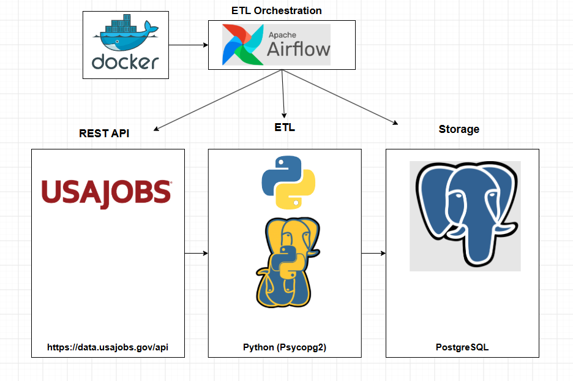
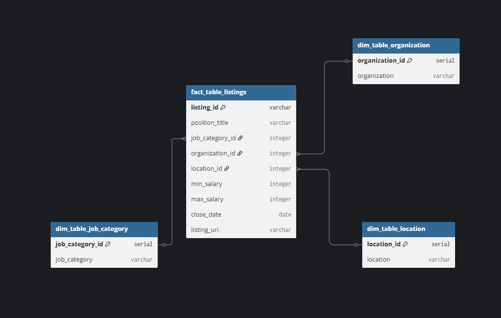

# Project Description

This project is an automated ETL pipeline built around the [USAJOBS](https://developer.usajobs.gov) public REST API. It extracts federal job postings related to data roles (specifically data engineer, data analyst, and data scientist listings), cleans and transforms the data, and loads it into a normalized PostgreSQL database built with a star schema. The entire pipeline is orchestrated end-to-end with Apache Airflow, running in Docker.

The pipeline runs on a daily schedule (every morning at 8:00 AM PST), detects and loads only new listings (no duplicates on repeat runs), and sends an automated email summary listing any new job listings after every run. Along the way, it handles real-world data engineering challenges, including API pagination, NULL/missing field handling, and reliable task orchestration with retry logic.

This README walks through my thought process behind the key decisions I made throughout this project, along with several implementations that reflect real-world data engineering problem-solving.

---

# Data pipeline architecture

- **REST API:** [USAJOBS](https://developer.usajobs.gov) was used to source new job listings for extraction.
- **Extract/Transform/Load:** Python, using the `psycopg2` library, handled extracting, cleaning, and loading the data into the database.
- **Storage:** PostgreSQL was used for data storage, structured as a star schema.
- **Orchestration:** Apache Airflow (running via Docker) automates the entire pipeline end-to-end, including scheduling and retry logic.

---

# Important Folders 

- [`DAG code`](DAG%20code) — This folder contains the single DAG file used by Airflow to orchestrate the entire pipeline.
- [`finished modular pipeline`](finished%20modular%20pipeline) — Final, modularized pipeline code (extract.py, transform.py, load.py, pipeline.py). pipeline.py was used to test the modular pipeline end-to-end before building the DAG file.
- [`original test pipeline`](original%20test%20pipeline) — Contains the initial single-file version of the pipeline, kept for reference to show the refactoring progression.
- [`sql`](sql) — Contains the SQL used to create the tables, following the star schema design.

---

# Database Design

- The diagram above shows the database's star schema design. This approach was chosen because several fields in the raw data were highly repetitive. organization and location repeated across many listings, making them strong candidates for normalization into separate dimension tables.

- A key design decision was adding `job_category` as a derived field, since it wasn't provided directly by the API. The raw `position_title` field couldn't be used for this purpose on its own, since it often included extra metadata beyond just the role type. It included things like seniority level or specialization (e.g., "Senior Data Analyst," "AI/Sports Data Analyst"). Because of this, titles rarely repeated in a clean, consistent way, so a separate `job_category` field was derived by matching keywords in the title. This gives a clean, reliable dimension to query and group by, while the original `position_title` is still preserved in the fact table for reference.