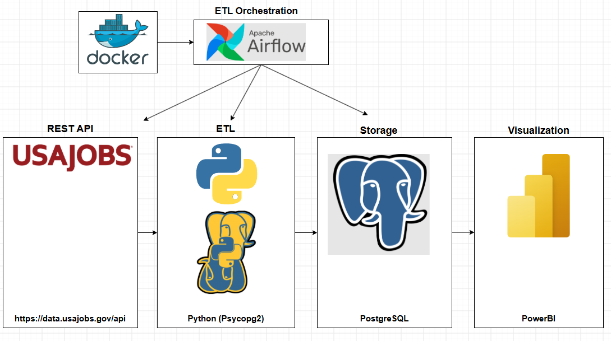
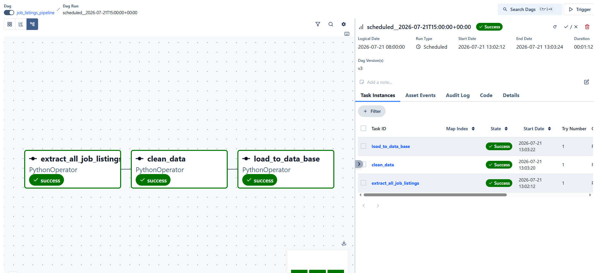
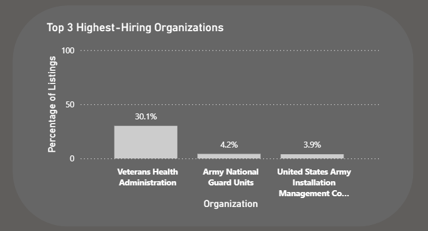
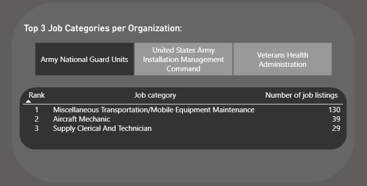
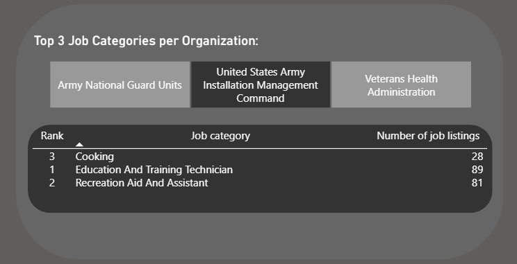
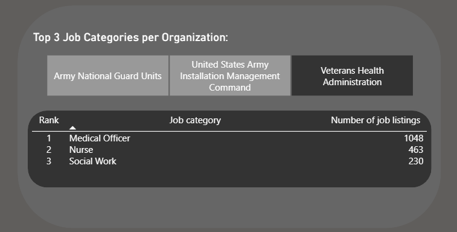
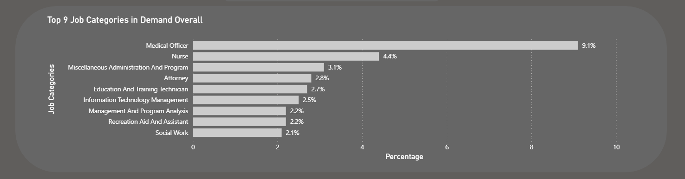
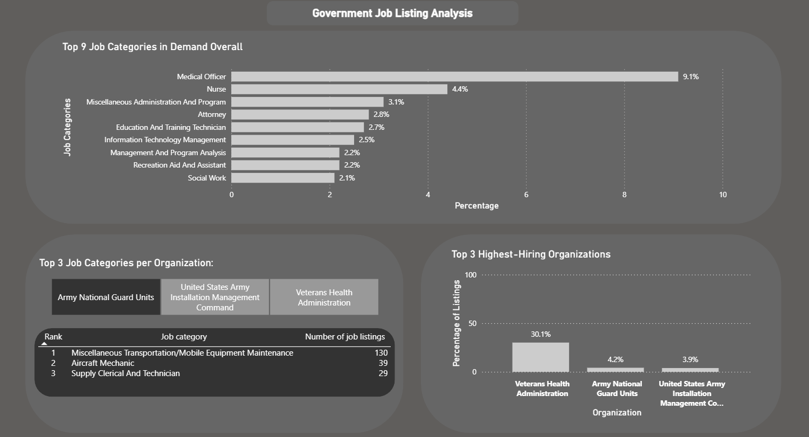

# Project Description

This project demonstrates an end-to-end data pipeline, built to analyze current federal job postings sourced from the [USAJOBS](https://developer.usajobs.gov) public REST API.

The pipeline extracts all available federal job postings, cleans and transforms the data, and loads it into a normalized PostgreSQL database built with a star schema. The entire pipeline is orchestrated end-to-end with Apache Airflow, running in Docker. It runs on a daily schedule (every morning at 8:00 AM PST), detects and loads only new listings (no duplicates on repeat runs), and handles real-world data engineering challenges, including API pagination, NULL/missing field handling, and reliable task orchestration with retry logic.

This README is organized in two parts. The first half walks through my thought process behind the key decisions I made when constructing the pipeline, along with several implementations that reflect real-world data engineering problem-solving. The second half walks through the analytical work and key insights found from the main analytical question proposed in part 2, using SQL views queried from PostgreSQL and visualized in Power BI.

---

# [Part 1]: Pipeline Construction

---

# Data pipeline architecture

- **REST API:** [USAJOBS](https://developer.usajobs.gov) was used to source new job listings for extraction.
- **Extract/Transform/Load:** Python, using the `psycopg2` library, handled extracting, cleaning, and loading the data into the database.
- **Storage:** PostgreSQL was used for data storage, structured as a star schema.
- **Orchestration:** Apache Airflow (running via Docker) automates the entire pipeline end-to-end, including scheduling and retry logic.

---

# Database Design

- The diagram above shows the database's star schema design. This approach was chosen because several fields in the raw data were highly repetitive. organization, location and job_category, repeated across many listings, making them strong candidates for normalization into separate dimension tables.

## Data Dictionary

| Column | Description |
|---|---|
| `listing_id`  | Unique identifier for the job posting, sourced directly from the USAJOBS API's PositionID |
| `position_title`  | The original, unmodified job title as listed by the employer |
| `job_category_id`  | Foreign key referencing the derived job category |
| `organization_id`  | Foreign key referencing the hiring organization/agency |
| `location_id` | Foreign key referencing the job's posted location |
| `min_salary` / `max_salary`  | The posted salary range, in USD. May be NULL if the employer didn't provide salary information |
| `close_date`  | The date the application window for this posting closes |
| `listing_uri`  | Direct link to the original USAJOBS posting |
| `organization` | The name of the hiring federal agency/organization |
| `location`  | The posted job location (city, state, or "Multiple Locations") |
| `job_category` | The specific occupational category |

---

# Important Folders

- [`airflow DAG code`](airflow%20DAG%20code) — This folder contains the single DAG file used by Airflow to orchestrate the entire pipeline. The DAG file relies on `extract.py`, `transform.py`, and `load.py` (which are located [`pre-airflow pipeline`](pre-airflow%20pipeline)) in being present in the same directory for Airflow to run correctly.
- [`pre-airflow pipeline`](pre-airflow%20pipeline) — The contents in this folder were used to test and confirm the pipeline worked via manual, single-run execution before Airflow was introduced. Once confirmed working, only `extract.py`, `transform.py`, and `load.py` needed to be referenced by the DAG file.
- [`sql`](sql) — Contains the SQL used to create the tables.

---

# Pipeline Explanation

## Extraction

- The extraction process relies on the USAJOBS public REST API.
- Specifically, I used the `/search` endpoint, which exposes the same search functionality available on the USAJOBS website itself.
- A major challenge I ran into was the API's hard result limit: an unfiltered search maxes out at 10,000 listings (`SearchResultCountAll`), regardless of how many jobs are actually posted.
- To work around this, I methodically split the searches to cover all listings, using a specific parameter: `JobCategoryCode`.
- The idea was that every federal job posting is assigned to a job family. For example, a broad occupational grouping (e.g., `2200` for Information Technology, `0800` for Engineering and Architecture). By querying each job family individually, I could stay well under the 10,000-result cap for every single request.
- This meant iterating over every job family code, pulling all current listings under that code, and repeating the process until every publicly listed job family had been queried. This effectively captures the full breadth of current USAJOBS postings.
- This extraction also handles pagination, since only 500 listings can be returned per API call (`ResultsPerPage`). For any job family returning more than 500 listings, the extraction automatically pages through the remaining results until everything for that family is retrieved.
- Each listing is stored as a dictionary containing its relevant metadata (title, organization, location, salary, close date, etc.), and all listings are collected into a single list for the next stage of the pipeline.

## Cleaning

- For this cleaning process, I did not want to remove a listing just because it had NULL values.
- Specifically, I only remove a listing if it's missing values for two key columns: `position_title` or `listing_uri`. This choice was deliberate. Without a title or a link back to the original posting, there would be no way to identify or view the job on USAJOBS, making the listing effectively useless for analysis.
- Listings with NULL values in any other field (like salary or close date) are kept as-is, since that missing data still leaves the listing meaningful and usable. This just reflects that the employer didn't disclose that particular detail.
- All text fields also have leading and trailing whitespace removed.

## Loading

- Loading was handled with the `psycopg2` library, which provides native PostgreSQL support within Python, allowing queries, inserts, and deletions to run directly from the pipeline script.
- To reduce overhead and avoid unnecessary work, the pipeline includes a check for new listings, ensuring that data already present in the database is never reprocessed or re-queried unnecessarily.
- Duplicate listings are checked at two levels: within the extracted list of dictionaries itself, and against what already exists in the database, before any insertion takes place. This was necessary because the broad market extraction pulls listings across many overlapping job category codes, meaning the same job posting can occasionally be captured more than once within a single run.
- screenshots of the loaded PostgreSQL data can be found in [`loadedPostgresData`](screenshots/loadedPostgresData).

## Airflow Orchestration

- Airflow allowed me to automate the entire process of extracting, cleaning, and loading the data.
- I used a DAG file to define the automation process, made up of three major tasks, each corresponding to one of the core pipeline files: extract, transform, and load.
- Airflow executes these tasks in the defined order every day at 8:00 AM PST.
- Note: since my dataset is relatively small (currently around 13,000 listings), I made the deliberate choice to hand off data directly between tasks using XCom, rather than writing to and reading from a shared storage location. I understand that in a typical production workflow with much larger datasets, this approach would introduce significant overhead and slow performance, since XComs aren't designed to handle large payloads efficiently. In that scenario, the standard practice is for each task to write its output to a shared location (such as a staging table), with the next task reading from that same location.
- I also implemented retry logic, so tasks automatically retry on transient failures (such as a temporary API timeout) before being marked as failed.
- Since Airflow captures and stores logs from any task automatically, I made sure to implement logging throughout my scripts to catch exactly where potential issues might arise, such as failed API calls, database connection problems, or data insertion errors. This means that when a task runs, whether successfully or not, Airflow's UI shows a clear, timestamped record of what happened at each step, rather than just a pass/fail status with no context.
- The example of a pipelines run logging process can be found in [`loggingExample`](screenshots/loggingExample)
### Airflow run

## Pipeline Limitations Summary

- XCom is used to hand off data between tasks. In a real production environment with larger datasets, tasks would ideally read from and write to a shared location (such as a staging table) to increase efficiency, since XCom isn't designed to handle large payloads.
- The pipeline can only run automatically (every day at 8:00 AM PST) if my local machine and Docker are left running, or if the pipeline is deployed to a cloud service provider for always-on availability.
- This project uses ETL rather than ELT. Modern data engineering practice often favors extracting data, loading it into a staging table first, and then transforming it using tools like dbt. For this project, I chose to demonstrate transforming the data before loading it, which is a simpler and more appropriate approach at this scale.
- The pipeline currently has no automated unit tests. Validation relies on manually observing task failures and reviewing Airflow's logs.

---

# [Part 2]: Job Listing analysis

---

For this part of the project, I wanted to analyze something that would provide 
real value to stakeholders. Specifically, I believe this dataset can help job 
seekers and career changers understand what types of roles government agencies 
are currently hiring for.

**The central analytical question this project addresses is:** "Which government agencies hire the most, what 
career paths do they mainly support, and is that concentration unique to them 
or reflective of federal hiring overall?"

This analysis aims to give job seekers a clearer view of which agencies are hiring most 
actively, what career paths those agencies primarily support, and whether that 
pattern is agency-specific or representative of federal hiring more broadly.

I will also provide a final recommendation which will answer which career fields/paths may benefit 
from pursuing government job opportunities, and which fields appear underserved federally and may be 
better pursued in the private sector.

I chose to analyze the following sub-questions to allow me to provide a thorough recommendation:

---

## 1. What are the top 3 agencies currently hiring the most?

- The top 3 agencies in federal government hiring are Veterans Health Administration, Army National 
Guard Units, and United States Army Installation Management Command.

---

## 2. Within each of those top 3 agencies, what are their top 3 career paths/job categories?

- Veterans Health Administration: 
    - Medical Officer 
    - Nurse 
    - Social Work

- Army National Guard Units: 
    - Transportation/Mobile Equipment Maintenance
    - Aircraft Mechanic 
    - Supply Clerical And Technician

- United States Army Installation Management Command: 
    - Education And Training Technician
    - Recreation 
    - Aid And Assistant, Cooking

---

## 3. Are these top career paths reflected in the dataset overall, or does each agency's hiring pattern diverge from the broader trend?

- Partially. VHA and Army Installation Management Command's top categories all appear within the 
overall federal top 9 categories, suggesting their hiring patterns are broadly representative of 
federal demand. However, Army National Guard Units' top categories (largely logistics and equipment 
maintenance) do not appear in the overall top 9, indicating this agency's hiring needs are more 
specialized and agency-specific rather than reflective of federal hiring as a whole.

---

## Dashboard Overview

---

# Final Reccomendation 